# M7ZM Clan Exclusive Website

Welcome to the M7ZM Clan's official website! This site is packed with exciting features and has been meticulously crafted to deliver an exceptional user experience. 🎉

## 📚 Table of Contents

1. [Features Overview](#-features-overview)
2. [Detailed Page Descriptions](#-detailed-page-descriptions)
   - [Profile Page](#profile-page)
   - [Explore Page](#explore-page)
   - [Search Users Page](#search-users-page)
   - [My Account Page](#my-account-page)
   - [Translate Page](#translate-page)
   - [Admin & Moderator Dashboard](#admin--moderator-dashboard)
3. [Gaming Pages](#-gaming-pages)
   - [Brawlhalla](#brawlhalla)
   - [Call of Duty](#call-of-duty)
   - [Overwatch](#overwatch)
   - [Fortnite](#fortnite)
   - [Saudi Deal](#saudi-deal)
4. [Project Structure](#-project-structure)
5. [Clarification and Acknowledgements](#-clarification-and-acknowledgements)
6. [Screenshots](#-screenshots)

## 🌟 Features Overview

### Beautiful Interface

Our website boasts a stunning interface created with React and the Next UI library, featuring elegant components and beautifully designed pages.

### Multi-Language Support

The site supports multiple languages, including:

- Arabic
- English
- Spanish
- French
- Russian

### Themes Galore

Choose from over 8 themes to personalize your experience. 🎨

### Auto Logout & Activity Check

- Auto logout functionality for inactive users
- Regular activity checks to ensure users don’t spend too much time without taking breaks

### Dynamic Home Page

- Conditional rendering based on user login status
- Showcase of features like videos, images, random heroes, legends, and Call of Duty releases
- Organized and visually appealing navbar

### Simple Sign-Up Process

Easy and straightforward sign-up process for new users. 📝

### Apology Page

Redirects users to an apology page for errors such as unauthorized access or private accounts, with appropriate messages. 🚫

## 📄 Detailed Page Descriptions

### Profile Page

- **Edit Profile**: Modify your profile details.
- **Uploads**: Upload images and videos with ease.
- **My Videos**: Edit or delete your videos.
- **My Images**: Manage your uploaded images.
- **Settings**: Adjust language and theme preferences.

### Explore Page

- **Explore Videos**: Discover and filter videos by tags.
- **Explore Images**: Browse through a variety of images.
- **Watch Video**: Watch videos in detail with like/dislike, favorite, and comment functionalities.

### Search Users Page

- Search for users by username or filter by authorization level.
- View detailed user profiles with various tabs like videos, images, favorites, and archived content.

### My Account Page

- Enhanced features with conditional rendering.
- Profile completion progress bar.
- Access to edit profile, favorite, and archived content.

### Translate Page

- Two-way translation between English and Arabic, including "Engrish" (a mix of English letters and numbers to represent Arabic). 🔤

### Admin & Moderator Dashboard

Exclusive features for admins and moderators to manage users, videos, and images. 🛠️

## 🎮 Gaming Pages

### Brawlhalla

- Access various stats and data using APIs.
- Features like random character selection, ranked data, and more.

### Call of Duty

- Comprehensive list of all Call of Duty games with filtering options.

### Overwatch

- View all heroes, maps, and workshop codes.
- Filter heroes by role, type, and more.

### Fortnite

- Extensive functionalities like viewing banners, battle royal map, cosmetics, shop, events, and challenges.

### Saudi Deal

- Visualize all cards with details and filters.
- Instructions for gameplay, burning cards, cheating rules, and more.

## 📂 Project Structure

```batch
Here's a comprehensive look at the project structure:
Root
├── build
├── node_modules
├── public
│ ├── brawlhalla_images
│ ├── images
│ ├── locales
│ ├── custom-share-image.png
│ ├── favicon.ico
│ ├── index.html
│ ├── logo192.png
│ ├── logo512.png
│ ├── manifest.json
│ ├── robots.txt
│ └── TermsAndConditions.pdf
├── src
│ ├── App.css
│ ├── App.js
│ ├── App.test.js
│ ├── i18n.js
│ ├── index.css
│ ├── index.js
│ ├── logo.svg
│ ├── reportWebVitals.js
│ ├── routes.js
│ ├── setupTests.js
│ ├── store.js
│ ├── Archive
│ │ ├── GetAllLegends.js
│ │ ├── GetLegendByID.js
│ │ └── GetLegendByName.js
│ ├── assets
│ ├── components
│ │ ├── AcmeLogo.jsx
│ │ ├── Icons.jsx
│ │ ├── LanguageSwitcher.js
│ │ ├── NavBar.js
│ │ ├── Administration
│ │ │ ├── AdminImagesTable.js
│ │ │ ├── AdminUsersTable.js
│ │ │ └── AdminVideosTable.js
│ │ ├── Brawlhalla
│ │ │ ├── BHRandomCharacter.js
│ │ │ ├── BHRandomCharacterHome.js
│ │ │ ├── GetAllLegends.js
│ │ │ ├── GetClanData.js
│ │ │ ├── GetRanked1v1Data.js
│ │ │ ├── GetRanked2v2Data.js
│ │ │ ├── GetRankedSeasonalData.js
│ │ │ ├── GetStatsByID.js
│ │ │ ├── GetStatsBySteamID.js
│ │ │ ├── GloryByID.js
│ │ │ └── GloryBySteamID.js
│ │ ├── CallOfDuty
│ │ │ ├── CodCard.js
│ │ │ └── Codhelpers.js
│ │ ├── Explore
│ │ │ ├── ExploreImages.js
│ │ │ ├── ExploreVideos.js
│ │ │ └── WatchVideo.js
│ │ ├── Fortnite
│ │ │ ├── ActiveEvents.js
│ │ │ ├── BattleRoyalMap.js
│ │ │ ├── BRNews.js
│ │ │ ├── Challenges.js
│ │ │ ├── Cosmetics.js
│ │ │ ├── CosmeticsByID.js
│ │ │ ├── CreatorCode.js
│ │ │ ├── GetAllBanners.js
│ │ │ ├── NewCosmetics.js
│ │ │ ├── News.js
│ │ │ ├── Shop.js
│ │ │ ├── STWNews.js
│ │ │ └── TwitchDrops.js
│ │ ├── icons
│ │ │ ├── ChevronIcon.js
│ │ │ ├── CopyDocumentIcon.js
│ │ │ ├── DeleteIcon.js
│ │ │ ├── DislikeIcon.js
│ │ │ ├── EditIcon.js
│ │ │ ├── EyeFilledIcon.js
│ │ │ ├── EyeIcon.js
│ │ │ ├── EyeSlashFilledIcon.js
│ │ │ ├── GalleryIcon.js
│ │ │ ├── HeartIcon.js
│ │ │ ├── LikeIcon.js
│ │ │ ├── LockIcon.js
│ │ │ └── VideoIcon.js
│ │ ├── OverWatch
│ │ │ ├── Composition.js
│ │ │ ├── GetAllHeros.js
│ │ │ ├── GetAllMaps.js
│ │ │ ├── GetHeroByName.js
│ │ │ ├── GetUtillData.js
│ │ │ ├── GetWorkshopCodes.js
│ │ │ ├── OWRandomCharacter.js
│ │ │ └── OWRandomCharacterHome.js
│ │ ├── Profile
│ │ │ ├── EditProfile.js
│ │ │ ├── MyImages.js
│ │ │ ├── MyVideos.js
│ │ │ ├── Settings.js
│ │ │ └── Uploads.js
│ │ ├── SaudiDeal
│ │ │ ├── SaudiDealInstructions.js
│ │ │ └── SuadiDealAllCard.js
│ │ └── Uploads
│ │ ├── UploadImage.js
│ │ └── UploadVideo.js
│ ├── data
│ │ └── AllBrawllLegends.json
│ ├── ducks
│ │ └── authSlice.js
│ ├── pages
│ │ ├── AdminDashboard.js
│ │ ├── Brawlhalla.js
│ │ ├── CallOfDuty.js
│ │ ├── Explore.js
│ │ ├── Fortnite.js
│ │ ├── Home.js
│ │ ├── Login.js
│ │ ├── NotFound.js
│ │ ├── OverWatch.js
│ │ ├── Profile.js
│ │ ├── SaudiDeal.js
│ │ ├── SearchUsers.js
│ │ ├── SignUp.js
│ │ ├── Translate.js
│ │ └── UserAccount.js
│ ├── services
│ ├── styles
│ └── utils
├── .gitignore
├── package-lock.json
├── package.json
├── postcss.config.js
├── README.md
├── tailwind.config.js
├── TermsAndConditions.md
└── Screenshots
```

## 📜 Clarification and Acknowledgements

This website is for learning and showcase purposes only. External API sources used:

- [Fortnite API](https://fortniteapi.io/)
- [Overfast API](https://overfast-api.tekrop.fr/)
- [Brawlhalla API](https://brawlhalla.vercel.app/)

All source code is created by Mohammed Aleshawi. External resources are credited accordingly.
For more details, please refer to our [Terms and Conditions](TermsAndConditions.md).

### Backend Repository

Visit the backend repository [here](https://github.com/meshawi/M7ZM-Gaming-Community-API.git).

## 📸 Screenshots

### Home Page

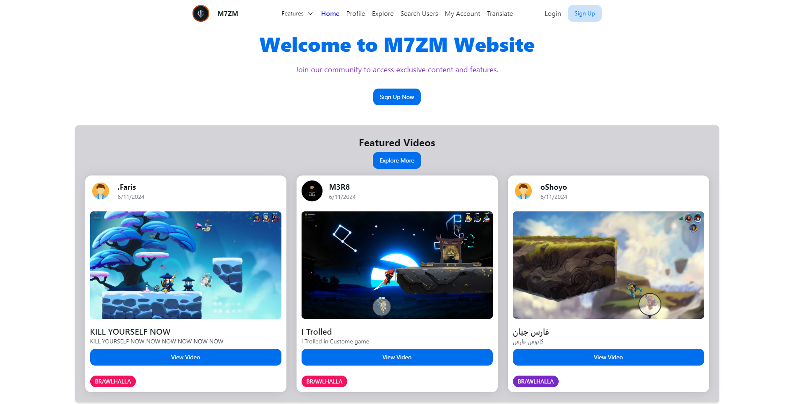

### Apoligy Page

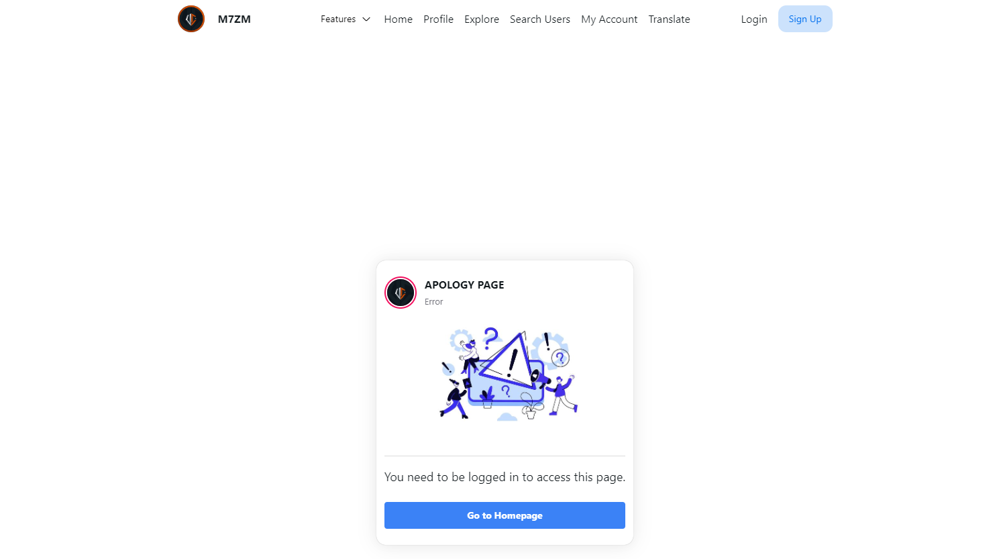

### Setting Page Dark mood

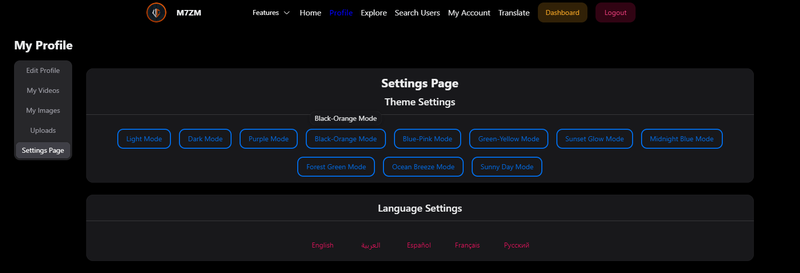

### Settings Page Russion with defrent mood

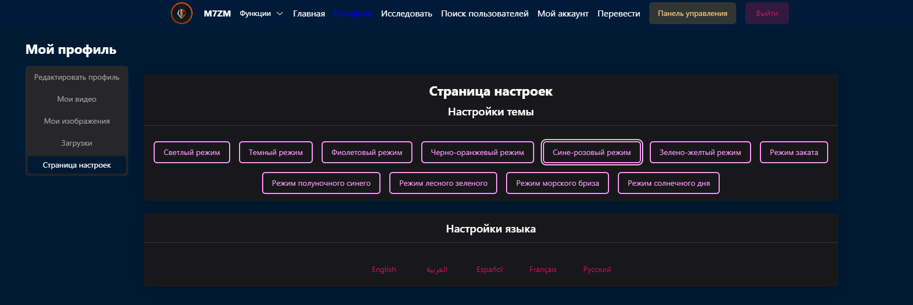

### Explore Page


### Search Users Page

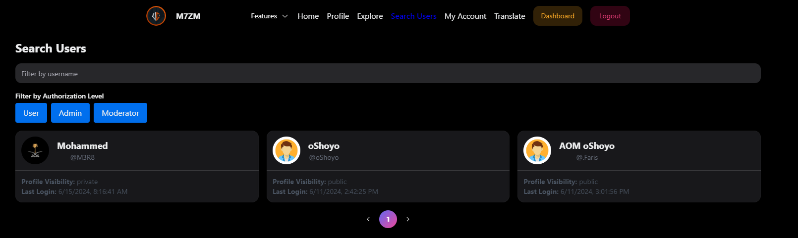

### My Account Page

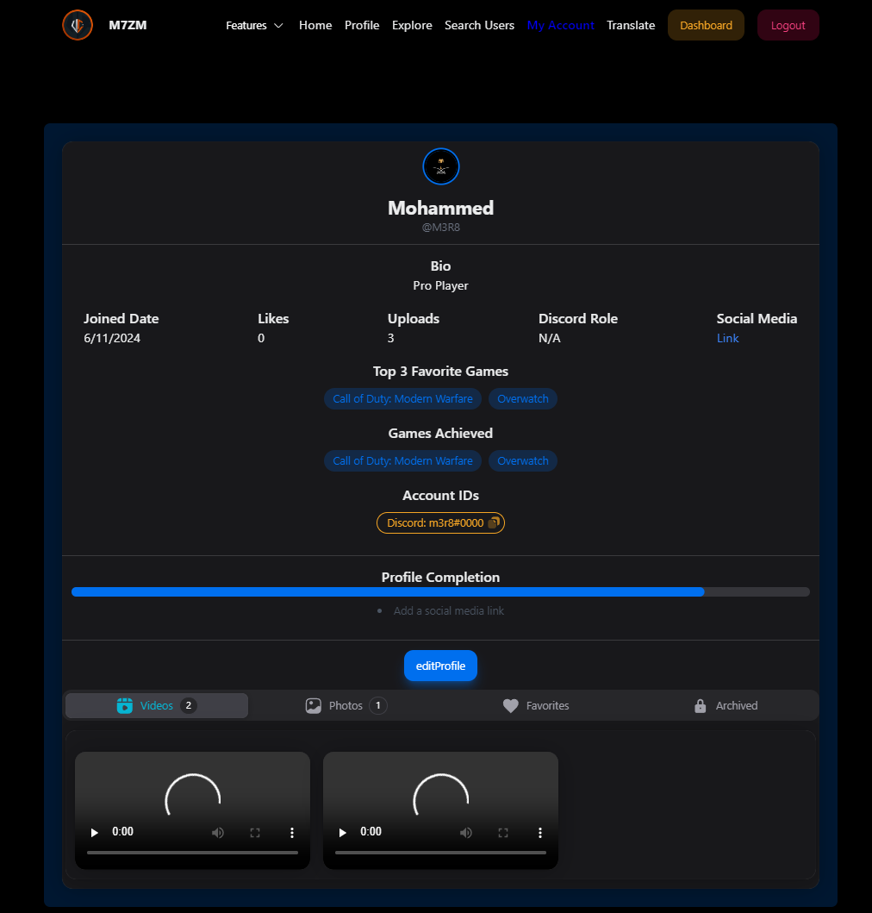

### Translate Page

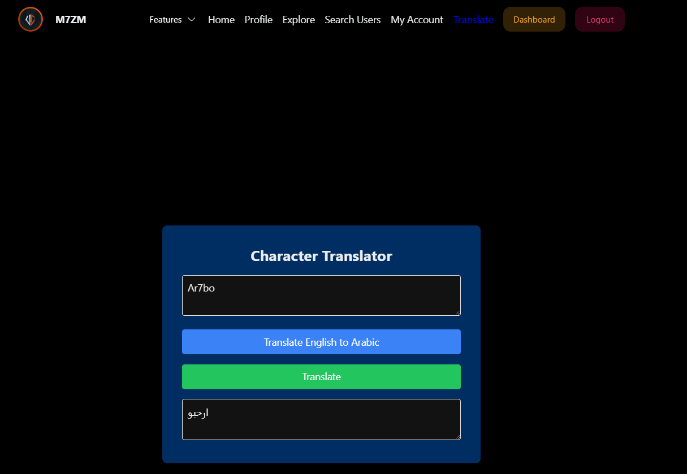

### Call of Duty Page

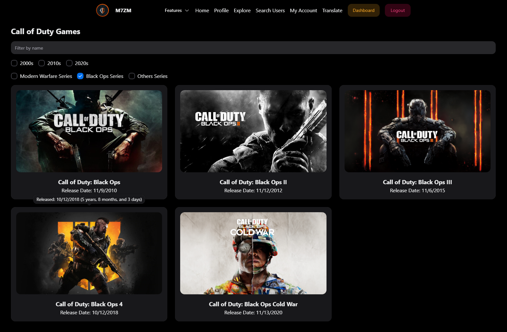

### Brawlhalla Page

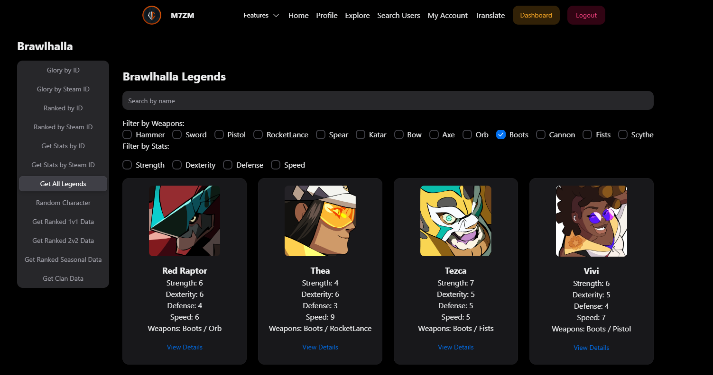

### Suadi Deal Page

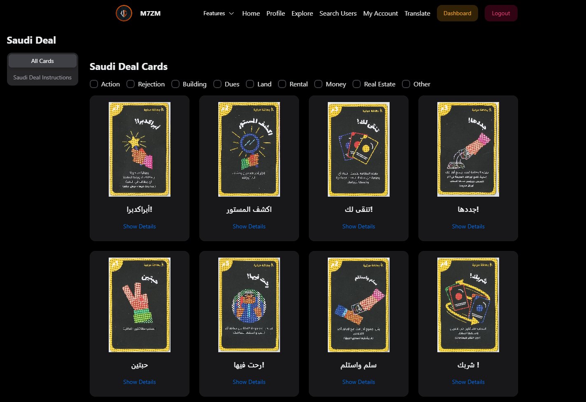

### Admin Dashbord

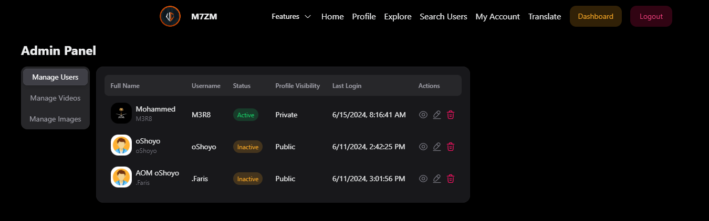

### Admin Dashbord

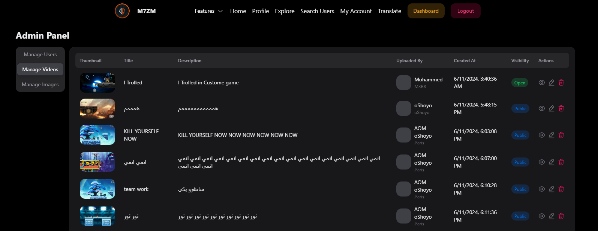

---
Enjoy your time on the M7ZM Clan website! 🚀
